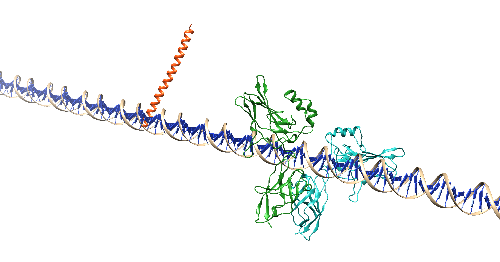

<h1 style="text-align:center">COMPLEX ASSEMBLER</h1>
<h2 style="text-align:center">by Aitor, Jorge and Lilian</h2>

<h2 style="text-align:center">Final project for the modules SBI and Python</h2>
<h3 style="text-align:center">M.Sc Bioinformatics at UPF</h3>
<h3 style="text-align:center">Second Trimester 2021</h3>

<div style="page-break-after: always;"></div>
# Table of Content
<!-- MDTOC maxdepth:6 firsth1:1 numbering:0 flatten:0 bullets:1 updateOnSave:1 -->  
- [1. Introduction](#1-introduction)   
- [2. Basics](#2-basics)   
   - [2.1 Installation](#21-installation)     
   - [2.2 File Format](#22-file-format)   
- [3. Theory](#3-theory)   
   - [3.1. Method and algorithm](#31-method-and-algorithm)   
      - [3.1.1. Protein-protein](#311-protein-protein)   
      - [3.1.2. Protein-Nucleic Acids](#312-protein-nucleic-acids)     
   - [3.2. Biological Problems](#32-biological-problems)   
- [4. Tutorial](#4-tutorial)   
   - [4.1. Protein-Protein Complex: 1gzx](#41-protein-protein-complex-1gzx)   
   - [4.2. Protein-Nucleotide Complex: 2O61](#42-protein-nucleotide-complex-2o61)   
   - [4.3. Protein-Protein Complex (with some nucleotide chains): 5fj8](#43-protein-protein-complex-with-some-nucleotide-chains-5fj8)   
- [5. Analysis](#5-analysis)   
   - [5.1. Evaluation for 1gzx](#51-evaluation-for-1gzx)   
   - [5.2. Evaluation for 2O61](#52-evaluation-for-2o61)   
   - [5.3. Evaluation for 5fj8](#53-evaluation-for-5fj8)   
- [6. Limitations](#6-limitations)   


<div style="page-break-after: always;"></div>

<!-- /MDTOC -->
# 1. Introduction
`complex_assembler.py` is a python script built as final project for both Python and Structural Bioinformatics subject from the M.Sc in Bioinformatics for the Health Sciences. The aim of this program is to reconstruct macro-complexes from `pdb` files for protein-protein or RNA/DNA-protein.


# 2. Basics
## 2.1 Installation
To install the program, please download the github repository and clone it somewhere in your local workspace. Once cloned, access the complex_assembler folderand run the following command:

```
sudo python3 setup.py install
```
Please, notice the sudo option is for stoping the program from crashing when permissions denied.

## Usage from the Terminal
In order for the program to run, the user simply has to execute the python script called __project.py__ and provide the obligatory arguments to obtain the model. A detailed explanation of possible arguments that may be provided to the program are listed below:

### Mandatory Arguments
__In- and Output files__
When running the program from the command line, the user has to give some specifications for example the path to the in- and output files.
```
'-i','--input'
'-o','--output'
```
The program only accepts __folders as input__. With the input command the user should provide the folder where the PDB files of binary interactions are stored. In order for the program to work correctly, it is recommended to have the input folder inside a folder where additional files (i.e. the stoichiometry file) are also stored. The input folder should have no subfolder since the program will crush in those situations.

Similarly, the __output parameter__ should lead to a path where a folder containing the output files will be created. In cases were the user wants to create a folder with a name currently in use, please check the __force argument__.

### Optional Arguments
__stoichiometry file__
```
'-s', '--stoichiometry'
```
The stoichiometry argument is optional. If the user knows the stoichiometry of the final complex, he can provide the __Path__ to the file containing the stoichiometry. Depending on the type of complex, the stoichiometry file should be in a certain format, as described in section [2.2 File Format](#fileformat).

__Nucleotide__
```
'-n','--nucleotide'
```
If the user wants to build a macro complex consisting of a nucleotide sequence, this option will be used to provide the file containing the full nucleotide sequence. This argument is optional, however when it is not provided and the program finds that the pdb files contain nucleotide and peptide sequence, an error will be raised and further execution of the program will be stopped.

```
'-f','--force'
```
__Force__ allows the user to overwrite and existing folder that shares name with the one provided for the __output__ argument. The default value is set to false, so it will not overwrite the conflicting folder and the program will just crush
#### ___Be aware!___, the current folder will be deleted after the program is run.

__Logging__
```
'-v','--verbose'
```
The verbose argument allows the user to receive notifications in the command interface as the program develops. __By default, this argument is set to False__, so unless the user calls the argument no notification will be displayed.

__Max Number of Clashes__
```
'-c','--clashes'
```
The user has the option to set a value as the maximal number of clashes that is considered when superimposing two chains for the model. Superimpositions above the threshold are discarded. The default value is set to 30 clashes.

__Max Iterations__
```
'-m','--max_iter'
```
The option max_iter specifies the number of maximal iterations to go over the input files to build the model so the program will not run indefinitely when infinte structures are built or if no new chains can be added to the model. The default value is set to 100, thus, when provided a high number of files the program might exit before the structure is finished.

__Protien-Protein / Protein-Nucleic Acid discrimination__
```
'-wt','--no_template'
```

This option allows the program to differenciate between protein-protein interactions and protein-nucleic acid interaction. By default, its values is set to 'nt', this means there is no nucleic acid template, thus the program will run under assumption of protein-protein interaction.
However, if it is set to 'wt', then the program will run for protein-nucleic acid, yet the user should provide the template for the nucleic acid.

__Nuc templae__
```
'-n', '---nuc'
```

Given the case the program runs model reconstruction for protein-nucleic acid interaction, the user must provide the reference structure of the nucleotide sequence (RNA or DNA).

__Threshold__
```
'-t','--threshold'
```

This option allows the user to change the threshold for number of clashes when superimposing protein chains. By default, it is set to 30, however it can be modified. Please, be aware the the highest the value, the worse the result.

__Model Evaluation__
```
'-ev','--eval'
```

This options allows the user to select whether to evaluate the macro-complex built or not. Please note that if set to true, it is compulsory that the naming of the input files has to contain the pdb-ID of the reference structure in the correct format as described in 2.2 File Format.


## 2.2 File Format
The program can be divided into two main parts: modelling protein-protein complexes and modelling complexes containing proteins and nucleotide sequences. In both cases, the user is requested to provide the input and stoichiometry in a certain format to allow the program to run smoothly.

In the first case of __protein-protein complex__, the files within the input folder should best have the following format:
          XXXX_A_B.pdb
where X is the 4 letter pdb-ID and A and B the chain IDs. This is especially relevant in case, the user wants to include the `-e` option to evaluate the final model by comparing it to a reference structure, because the reference structure will be taken from the pdb-code here.


The chain ID can be repeated between files but not within a file. It does not matter if different chains have the same chain ID (the program will not assume chain A in one file equals chain A of another file). The stoichometry file, if provided, should hold the following format using the full filename:

                  |         | Protein-Protein                     |
                  |--------:|-------------------------------------|
                  | Format  | [filename1]:3                       |
                  |         | [filename2]:2                       |
                  | Example | 1gzx_A_D:3                          |
                  |         | 1gzxA_C:2                           |
|   |   |   |
An example for this can be seen in the example 1 on 1gzx.


For the second case of a __complex containing nucleotide chain()__, depending on the information a file contains, two approaches are available:
In one the files should be formatted in the following manner:
          YYYYYY.DNA.XXXX_A_EF.pdb

where the 6 Ys are placeholders for the sprot-ID of the proteincomplex, the X again replace the pdb-ID, A is the protein chain and EF will be the two double strand DNA chains ( {protein_name}.DNA.{pdb_name}_{chain} _{dnachains}.pdb ). In case of a one stranded RNA, the file name would hold only 'E' instead of 'EF'.

The stoichometry file should be presented as the following:

                  |         | Protein-Nucleotide                 |  
                  |--------:|------------------------------------|
                  | Format  | [protein_complex1]:1               |   
                  |         | [protein_complex2]:3               |   
                  | Example | P05412:1                           |   
                  |         | P15336:3                           |   

Additionally, the user is requested to provide a the path to a file of a reference nucleotide using the `-n` argument. This file does not have to be named specifically but should only contain one or two nucleotide strands, no further peptide sequences.

An example for a protein-nucleotide complex can be seen in example 2 on 2O61.

<div style="page-break-after: always;"></div>


# 3. Theory
## 3.1. Method and algorithm
The program takes a general approach shared for both kind of inputs (Protein-Protien & Nucleic Acid-Protein).

From the general approach, our algorithm would access the input file and look for files ending with `.pdb` extension, this means they need to be extracted from any compressed format. It is not necessary to remove any the file but please, notice it will not be taken into account as input file. However, if the notation of files is not the appropriate, an error message will be send to the command line for further information.

Once the files are chosen, they are processed to extract the information for the sequences using the function `read_pdb_files` available in the script [functions.py](./functions.py). This functions benefits from the `PDB_parser` module in the Biopython package. For each file the structure (containing the id and the file) is extracted and alpha carbons structures are obtained for every chain inside a single file. Besides, the heteroatoms are removed since they may not be meaningful for the final protein structure (for example, water).

Once the heteroatoms are removed and the alpha carbons structures are stored, the sequence for the latter is obtained. In order to avoid matching complexes out of ligands and cofactors, we set a threshold of 25 residues length below which we will not use the given protein for our study.

Once this is done, the program will differentiate between protein-protein and nucleic acids-protein input files. This is done by calling another function developed named `alpha_carbon_retriever`. This function takes a given chain as input and processes it in order to determine whether it is a protein or nucleic acid. This is done by looking at the residues in the chains:

- If it has _CA_, then it is taken as protein,
- If it has _C4_, then it is taken as a DNA, RNA according to the notation ('DA','DT','DC','DG','DI' for DNA and 'A','T','C','G','I' for RNA).

According to this, chain type is selected and the alpha carbons or C4's are retrieved.

### 3.1.1. Protein-protein
If the user does not indicate the 'wt' option, and the chain-type is protein, a message will prompt saying so to the terminal (given the case the user has selected so with the option verbose).

__The general approach can be summarized as the following:__
- obtain reference structure and iterate over possible moving structures to be added
- align chain of reference and moving structure
- if good alignment score: superimpose the two
- if good RMSD: check for clashes
- if clashes < threshold: add moving structure to reference structure
- repeat previous steps for the next moving structure using new reference structure

#### Build a model
The following will describe in detail, how the program will construct a model. First, it assigns the first structure as the __reference structure__. We made sure that the file chosen as the reference is included in the stoichiometry for the model.

It then starts to iterate over the other binary structures until the number of chains added is the same as the sum of the stoichiometry required (if not stoichiometry was provided, by default the program will try to add each binary once to the final model). During this iteration, the function `superimpose_chains` will __align__ the moving structure with the reference structure. If the alignment score is above the predefined threshold of 0.95, we use the  `Superimposer ` from  `Biopython` to obtain the rotation and translation matrix for the __superimposition__ of the reference chain and the moving chain.  `Superimposer` further comes with the option to obtain the RMSD for the superimposition. If the __RMSD__ is below 2, we can assume that the superimposed objects are highly similar. In this case, we add the possible superimposition to the dictionary file that will be returned by the function `superimpose_chains`. If no superimpositions have been found, our program will prompt a message accordingly.

In case, the dictionary of possible superimpositions is not empty, we will use the  `NeighbourSearch` from  `Biopython` integrated in our function `check_for_clashes` to look for __clashes__ between the not-superimposed chain and other chains of the reference structure. The threshold of acceptable clashes can be defined by the user with the option '-c', the default value is set to 30. If the number of clashes stays below the threshold, we can apply the previously obtained superimposition matrix to the not-superimposed chain of the moving structure and __add it to the reference structure__.
The new reference structure now contains the newly added chain and can be further compared to the next binary structure until the requirement of the stoichiometry file is full filled.

As we have to face the possibility, that no files from the input folder can be aligned and superimposed without clashes, this would end in an infinite loop that will never full fill the stoichometry. Thus, we included a counter for the number of iterations before the while-loop while be exited. By default this value is set to 100. However, in special cases, the user might want to adjust the __maximum number of iterations__ (`-m`) to a higher number, for instance if the folder he provides as input contains a high number of binary interactions.

#### Evaluate the built model
The user can specify the option `-e` to run an evaluation after the model was build. It has to be noted, that in order to run this option, the user has to know (or have an idea on) which pdb complex, its model should be compared to. The pdb code has to be **named in the filenames**. If the evaluation argument is set, the program will look in the filenames of the input folder for a pdb code and use the retriever function from `Biopython` to obtain the according pdb file.

The program will superimpose the reference structure to the model and print the RMSD to the analysis file. This gives the user an idea on the goodness of the model given a reference structure is known.

### 3.1.2. Protein-Nucleic Acids
For the provided input folder from the user, the naming of the files holds more information as for protein-protein complex, as described in 2.2 File Format.

For example, one file could be name P05412.DNA.1t2k_C_EF.pdb, meaning P05412is the protein complex, having DNA which binds toprotain domain 1t2k chain C, and DNA chains ids are E and F.

In this case, the user must have provided also a reference structure of DNA against which the comparison will be done for each file.Since the program works for both DNA and RNA, it also takes into account how many chains this reference structure has.

#### Build a model
The program calculates the nucleotide sequence for the reference nucleic sequence (and in case it is double-stranded, it appends the second strand to the first one), so it will be used as template for looking each DNA chain. So, for each file, the program will take the first DNA chain and get its sequence, and compare it to the reference nucleic acid sequence in order to find the matches; if no matches were found in the first chain it will look for matches in the second one, given the case there are 2 chains in the input files.

So, for each complex inside the stoichiometry file, while the it is needed as many times as indicated, the program will loop to construct it. for this purpose, it sets the coordinate of where the first base of our DNA fragment is located and the coordinate of where the last base of our DNA fragment is located. then append the coordinates to the end of the list, in case we may need to reuse them. Finally, extract the atoms our atoms from the big reference DNA from one of the possible locations (if available).

If the length of the atoms to be compared is different, the program will continue. If not, the program will look for clashes between the protein chain to add and the current reference structure (structure which each iteration is increasing the number of chains by which is formed). If the number of clashes between atoms is less than a certain threshold (30 by default, although this value can be modified by the user in the parameters), the chains are superimposed. It is remarkable that, given that we are looking for the matching patterns of DNA inside the reference nucleic acid, no check for clashes will be done for DNA chains, expecting them not to interfere with the current structure.

#### Evaluate the built model
The user can specify the option `-e` to run an evaluation after the model was build. It has to be noted, that in order to run this option, the user has to know (or have an idea on) which pdb complex, its model should be compared to. The pdb code has to be **named in the example input folder**. If the evaluation argument is set, the program will look in the input folder name for a pdb code and use the retriever function from `Biopython` to obtain the according pdb file.

The program will superimpose the reference structure to the model and print the RMSD to the analysis file. This gives the user an idea on the goodness of the model given a reference structure is known.


## 3.2. Biological Problems
Past studies suggest that proteins may not work individually, but they will rather form a complex with other molecules in order to full fill certain functions. A classic examples for a model of an interaction can be found for ribosome or enzymes like the NADH dehydrogenase. While traditional experimental techniques such as x-ray crystallography and nuclear magnetic resonance (NMR) spectroscopy have been crucial in characterising the structure of a great amount of proteins, the evidence on structures of macro-complexes is still scarce given the large size and structural flexibility these molecules present.

However, with the rapid development of computers and decay in the computational hardware cost, fields such as computational biology have greatly bloomed, and provide promising help in predicting structures of macrocomplexes _in silico_ based on the huge amount of data recovered by traditional techniques. Our project takes a simple approach to this problem by employing superimpostion between highly similar chains as a basis. __Superimposition__ is defined as the procedure by which which two molecule structures (two proteins, two DNA/RNA molecules, etc) are placed in space-minimizing the distance between backbone atoms of both structures. If we were to compare sequence alignment with structural alignment, equivalent residues would be the ones filling the same position in a multiple alignment (according to a sequence similarity score), in structural alignment equivalent residues would be the the closest ones.

Once two chains that can be superimposed are identified, it is possible to calculate translation and rotation matrices so the coordinate system of both structures are identical. By equating the coordinate system, we are able calculate how different the equivalent chains are. There are multiple measurements available to evaluate the structural alignment, but the most simple one, the Root-Mean-Square Deviations (RMSD), was  the one employed in this project. RMSD is based on the average distance between two sets of atoms, usually the backbone atoms (α-carbons in the case of proteins and C4 carbons in DNA/RNA strands) of the superimposed molecules. By convention, bellow a value of 3 both structures will be considered the same.

<div style="page-break-after: always;"></div>


# 4. Tutorial
In the following, we will present a Tutorial to run the program on three different examples. The output models will be discussed in section 4. Analysis in 5. Limitations in 6.

__Disclaimer:__ the code lines in the following examples are provided given the fact that the user did NOT install the program. This means that the commands lines here call `python3` to open the script of `complex_assembler.py`.
When the program was installed, the commands have to be called without calling `python3` and slightly modifying the path to the example folders. The following example will illustrate the differences:

__If program NOT installed:__
```
python3 complex_assembler.py -i ../examples/example_1/1gzx -o ../examples/example_1/output_withstech \
-s ../examples/example_1/stech_ex1.txt -f -v
```
__If program installed:__
```
complex_assembler.py -i examples/example_1/1gzx -o examples/example_1/output_withstech \
-s examples/example_1/stech_ex1.txt -f -v
```

## 4.1. Protein-Protein Complex: 1gzx
As the first simple example for a protein-protein macrocomplex, we will present the heteromer [1gzx](https://www.rcsb.org/structure/1GZX). It is a heamoglobin consisting of four chains as it can be seen in the following figure.


__Figure 1:__ _1gzx 3D structure from pdb database, colored by chains_

The provided input folder (`examples/example_1/1gzx`) consist of three different files:
* File1: 1gzx_A_B.pdb
* File2: 1gzx_A_C.pdb
* File3: 1gzx_A_D.pdb
In this example, it can be noted that chain A in File1 is not a homologue to the chain A in File3. Thus, the naming of the chains is not relevant for the building of the model. For instance, File2 contains the binary interaction of two homologue proteins.

Furthermore, we provide the user with a stoichiometry file (`examples/example_1/stech_1gzx.txt`). This way, one can compare how the built structure differs when including the `-s` argument. The stoichiometry file consists of the following lines:
```
1gzx_A_B:2
1gzx_A_D:1
1gzx_A_C:1
```

The final command has to be run on the terminal in order to build the macro complex of 1gzx:
```
python3 complex_assembler.py -i ../examples/example_1/1gzx -o ../examples/example_1/output_withstech \
-s ../examples/example_1/stech_ex1.txt -f -v
```
|   Argument       |          |    Addition                 | Explanation                                                |  
|-----------------:|----------|-----------------------------|----------------------------------------------------------|
| Input folder     | i       | examples/example_1/1gzx     | path to the folder containing the input files             |   
| Output folder    | o   | examples/example_1/output_withstech | path to the output folder: pdb file of model, analysis file |   
|Optional:         |        |                             |                                                           |   
| Stoichiometry    | s     | examples/example_1/stech_1gzx.txt | path to provided stoichometry                             |   
| Force output folder | f    |                             | overwrites output folder if already exists                |   
| Verbose          | v       |                             | prompts standard output to terminal                       |   


The output is stored in 'final_complex.png' in a folder at examples/output/1gzx_stech. If everything runs correctly, the model is expected to look like the following:


__Figure 2:__ _1gzx with a stoichiometry file provided, colored by chains_

It can be seen that the final pdb file of our model contains 4 chains, as indicated by the stoichiometry file. Since the first pairwise interaction was used twice for our model, the program automatically randomised the chain ID the second time the structure was added to avoid duplication.

If no stoichiometry file would be provided for this example, the command can be modified. Note, that it is almost the same as before, however without the option `-s` and we direct the output to a new folder to not overwrite the previous model.

```
python3 complex_assembler.py -i ../examples/example_1/1gzx -o ../examples/example_1/output_nostech -f -v
```

When running this command, the model should look lie the following:


__Figure 3:__ _1gzx with NO stoichiometry file provided, colored by chains._

Comparing the two figures above, it can be seen that in the case of no stoichiometry provided, the final complex only contains three chains. As explained under limitations, our program will consider each structure only once in the case that the user provides no stoichiometry file for the protein-protein complex.


## 4.2. Protein-Nucleotide Complex: 2O61
[2O61](https://www.rcsb.org/structure/2O61) is an example for a protein-nucleotide complex. The model describes a structure of NFkB, IRF7, IRF3 bound to the interferon-b enhancer. The 3D structure from the pdb file for 2O61 can be seen in figure 3:


__Figure 4:__ _2O61 3D structure from pdb database, colored by chains._

As this is a rather complex model, the input folder holds 54 pdb files containing binary interaction between one protein sequence and the according DNA double strands. Thus, each file holds three chains. In contrast to the example of 1gzx, the naming of the files holds more information in this case:

        {protein_name}.DNA.{pdb_name}_{chain} _{dnachains}.pdb

Example:
        Q14653.DNA.2pi0_D_EF.pdb

This file holds part of the protein Q14653 which is Interferon regulatory factor 3 (IFR3, here chain D) in combination with a DNA double-strand (chain E and F).

As mentioned in [2.2 File Format](#fileformat), the user has to provide the stoichiometry in a different format than for the protein-protein complex. This is because for complexes including DNA, the stoichiometry file consists of the name of the sub complexes and the number of times they shall be included in the final model. For this example, the optional stoichiometry file provided contains the following lines:
```
P05412:1
P15336:1
P19838:1
Q04206:1
Q14653:4
```

The final command run on the terminal to conduct a model for 2O61 including a stoichometry is:

We are aware that the template DNA may not be always available. In such cases (e.g. presented under 4.3 for 5fj8), the program tries to build a model based on the same approach as for protein-protein interaction. This requires information regarding the relative position of protein complexes and DNA. Is this the case, the stoichometry provided by the user needs to be in the same format as described for the [1gzx](https://www.rcsb.org/structure/1GZX) complex reconstruction.
```
python3 complex_assembler.py -i ../examples/example_2/2O61 -o ../examples/example_2/output_withstech \
-s ../examples/example_2/stech_ex2.txt -wt -n ../examples/example_2/ref_dna.pdb -f -v
```

|   Argument       |          |    Addition                 | Explanation                                                |  
|-----------------:|----------|-----------------------------|----------------------------------------------------------|
| Input folder     | i       | ../examples/example_2/2O61     | path to the folder containing the input files             |   
| Output folder    | o   | ../examples/example_2/output_withstech | path to the output folder: pdb file of model, analysis file |   
|Optional:         |        |                             |                                                           |   
| Stoichiometry    | s     | ../examples/example_2/stech_ex2.txt | path to provided stoichometry                       |   
| With Template    | wt     |                               | clarify that the model shall be build using a reference nucleotide  |   
| Stoichiometry    | n     | ../examples/example_2/stech_ex2.txt | path to file of reference nucleotide                       |   
| Force output folder | f    |                             | overwrites output folder if already exists                |   
| Verbose          | v       |                             | prompts standard output to terminal                       |   


The build model should look similar to this:


__Figure 5:__ _2O61 with stoichiometry file provided, colored by chains._

The same command but without a stoichometry file, would look as the following:
```
python3 complex_assembler.py -i ../examples/example_2/2O61 -o ../examples/example_2/output_nostech \
-wt -n ../examples/example_2/ref_dna.pdb -f -v
```
The output is stored in final_complex.pdb in the folder examples/example_2/output_nostech.
However, since already the building of the first model only included 3 chains and could not fully satisfy the stoichiometry, not providing a stoichiometry did not change the final complex. Thus, the model looks the same as presented in figure 5.

## 4.3. Protein-Protein Complex (with some nucleotide chains): 5fj8

Modelling the complex [5fj8](https://www.rcsb.org/structure/5FJ8) could be considered a middle point between the previous two approaches. The 3D structure of the pdb file for 5j8 looks like the following:


__Figure 6:__ _3D structure of 5fj8 from pdb database, colored by chains._

In this example, we find several PDB files with two protein chains and some PDB files with DNA-Protein chains (files did not have more than two chains and at least one of the chains was always a protein chain). In total the input folder holds 44 files. The approach in this case is the same as the one for the reconstruction of complex _1gzx_. However, since it is not possible to superimpose chains of different molecule types, we would avoid such comparisons when we tried to superimpose.

The stoichometry file provided (if provided) must look similar to the one described in the _1gzx_.

Similarly, the command `-wt` cannot be used since we will not provide a DNA template as a reference.

Once more, if the complex is run without any stoichometry file, each of the available files will only be employed once. Since no stoichiometry, nor a reference nucleotide can be provided, the command to obtain the model for this example is:

```
python3 complex_assembler.py -i ../examples/example_3/5fj8 -o ../examples/example_3/output -f -v
```

As for all previously presented examples, we advise the user to implement the `-e` parameter when calling the program, so an evaluation file based on the RMSD between identical chains of both models is performed.

<div style="page-break-after: always;"></div>


# 5. Analysis
As it was stated in the algorithm section, evaluation of the built model can be performed for both approaches (protein-protein interaction and nucleic acid interaction). In this section, the previous examples will be analysed regarding this evaluation of models.

## 5.1. Evaluation for 1gzx
When comparing the native model to the complex that the program has built and superimposing both of them (using external softwares such us Chimera), one may notice that the differences are barely noticeable. However, there are some points that can be discussed.

On the first hand, when user provides the stoichiometry field, our program builds a final complex using as many chains as the sum of chains given in this file. However, the program selects which chain appears X times randomly. Since we were told that one cannot relay on the chain name in order to know if chains are different, we came out with this solution, partially good and which provides with quite nice results.

On the second hand, when the user does not provide any stoichiometry file, the complex will be build using each present chain once. This may also lead to some differences with respect to the native complex downloaded from pdb.

Figure 7 additionally displays the superimposition of our model (blue) and the pdb-file of 1gzx downloaded from the pdb database (red). As it can be seen, the two models show a perfect superimposition with an RMSD of 0.


__Figure 7:__ _Our model and the reference structure for 1gzx superimposed (blue=our model, red = reference from pdb)._


## 5.2. Evaluation for 2O61
When comparing the native model to the complex built using the program and superimposing it several things can be noticed.

First, looking at figure 8, there is not a complete reference model for the 2O61 complex, because we are missing some native parts (red) in places were we have modeled (blue). Once, superimposed, the superimpositions is not enitrely good, however minor differences appear in the superimposed chains. Nonethelss, there are some chains missing in our model in comparison to what we can find in the native one. When running the program, if verboes options set, one may notice that several chains are skipped either for high number of clashes or because of the RMSD. Howeveer, improving the RMSD did not show any improvement in the modle (not shown in figures, but tested).

We would also like to remark the format of the input files for this examples. Some of them contains HETATM in some nucleotides for the DNA chian, which lead to different size the reference atoms and atoms to add when it came to superimposition. Due to this length difference, those files had to be skipped. Besides, when trying to replace the apparently incorrect HETATM with ATOM follwed by the correct number of spaces in order to keep track of the correct pdb format, an error message for wrong coordinates prompetd, stoping us from adding these files anyways. This problem also helps to explain the difference in terms of number of chains between our model and the native complex.


__Figure 8:__ _Our model and the reference structure for 2O61 superimposed (blue=our model, red = reference from pdb)._


## 5.3. Evaluation for 5fj8

At a first glance, the model built by the complex_assembler program is really close to the reference model available at PDB. When we take a look at the RMSD between the corresponding chains, the values are really really low.

Nevertheless, the model does have its flaws. The main differences we can find between both models lay in the presence/absence of DNA chains in the model. Unfortunately, we were not able to add the DNA chains in such scenarios possibly due to the number of clashes.

Additionally, in the image it can be seen that several chains are lacking in our model. Once more, it is important to mention that the model shown in the image was constructed with only one iteration of every file provided in the respective example folder. Consequently, it may be possible that some of the chains may be lacking because the stoichometry was not the adequate one. Regrettably, due to time constrains, we could not perform more tests for this particular structure, but it is highly advised for the user to perform several tests with the stoichometry file in order to obtain the best possible outcome.


__Figure 9:__ _Our model and the reference structure for 5j8 superimposed (blue = our model, red = reference model)._

<div style="page-break-after: always;"></div>


# 6. Limitations
In general, our program is able to build a model depending on the user input. We can obtain a model that tries to satisfy the stoichiometry provided by users or even builds a model with no stoichometry provided. It is able to process inout files of protein-protein or protein-nucleotide interactions and additionally includes an option to evaluate the built model in regards to a reference structure from the pdb database.

Nevertheless, we note that our program comes with limitations that have to be mentioned. First of all, the models the program build for nucleotide-protein complexes mostly do not agree with what we expect to obtain. We discussed this in more detail on the example 2061 in section 5.2.

It has also to be mentioned that the program demands certain formats. As described in the previous sections, the stoichiometry file has to be provided in a certain format depending on whether the user wants to build a protein-protein complex or a nucleotide-protein complex. Additionally, in the case of a nucleotide complex, the chains in the provided pdb files are expected to contain the peptide chain in the first position and then the nucleotide chain(s).

Furthermore, the final complex will be limited if the user does not provide the stoichiometry. In this case, the program will build the macro complex for protein-protein by considering each interaction structure only once. If a certain structure should be included more than once in the final model, the user has to indicate this in the stoichiometry file. In the case of infinite models, the user can simply provide a stoichometry file with a number big enough (i.e. file_name:9999999).

We are also aware that, when looking for clashes, the program only compares α-carbons. As discussed in class, the better approach would have been to consider ß-carbons as they provide additional information on the direction of side chains.

Additionally, our program only offers little option to control the goodness of the built model. In case the final structure of the model is known by the user and can be found in the pdb database, the program will run a superimposition and calculate the RMSD. However, in many cases, the user might not be in hand of a fitting reference structure. Our program could be improved by advanced evaluation options and eventually offer to optimise the built model accordingly.
One option here could be to,

In this context, it could also be interesting to create more than one model and compare their statistical potential, for example using PROSA to separate weak models.

So far, the program can only be run from the command line. As we decided to give the user quite a high number of options to be defined, it could be interesting to code a GUI that gives a better overview on the different arguments. We started coding a GUI using tkinter, however, it is still in progress and thus something we will proceed working on past the deadline.

It would be also considerable to study whether DNA sequences clash or not when it comes to nucleic acid and protein interaction. In our approach, we assume that given the matching pattern, this will not cause any trouble. However this is something to be taken under consideration and could be solved by evaluating several different examples with more precision.

Last, but not least, it is important to mention the computational toll the program supposes. Due to the high number of comparisons and alignments performed in order to add a new chain to the model, as the model keeps growing, each step takes more time, which is further exemplified when we try to build an infinite model. In those scenarios, the program does take a long time to run and depending on the available hardware resources, it may even crash if not careful enough.
