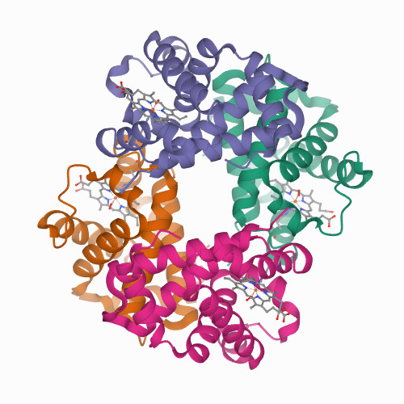
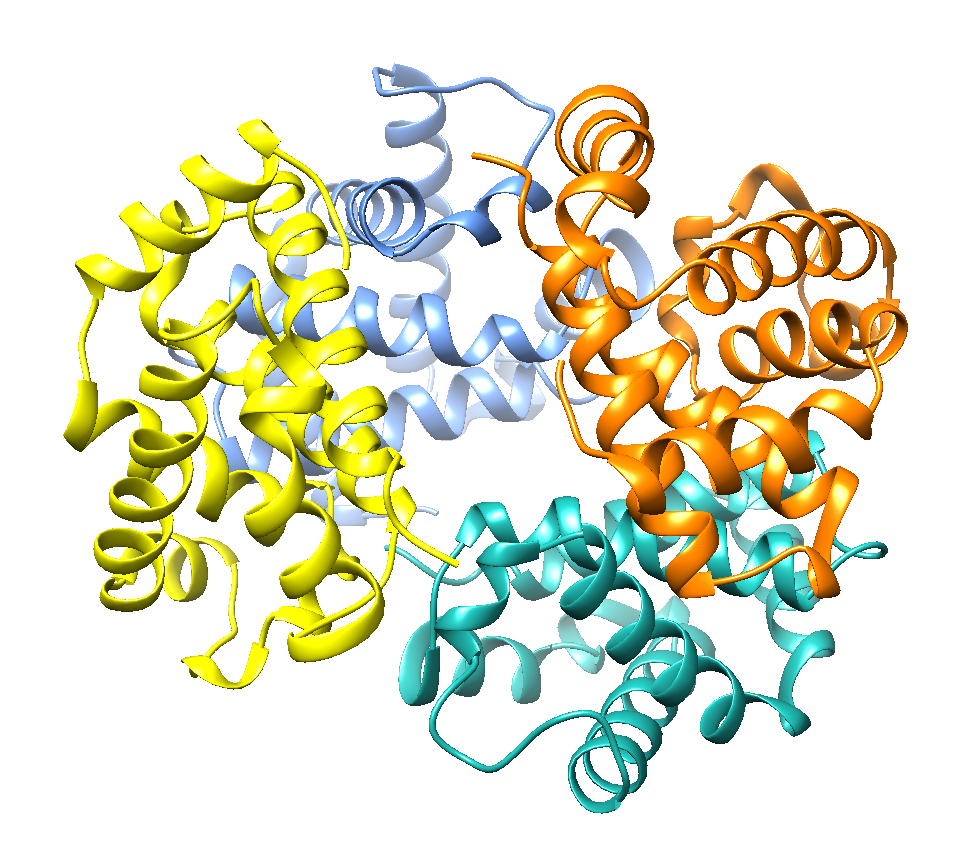
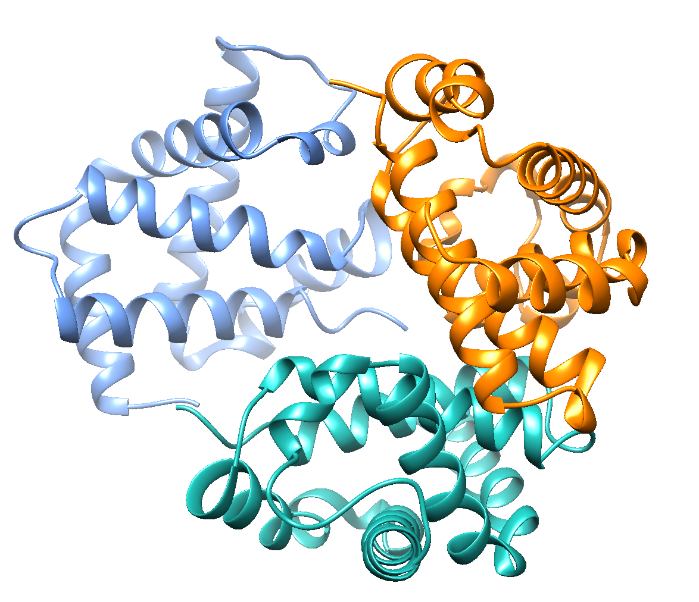
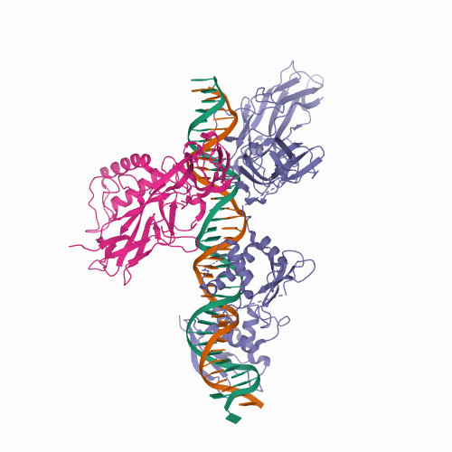

# MACROBUILDER
*by Aitor, Jorge and Lilian*

# Table of Content
<!-- TOC depthFrom:1 depthTo:6 withLinks:1 updateOnSave:1 orderedList:0 -->
- [1. Introduction](#introduction)
- [2. Tutorial](#tutorial)
  - [2.1 Installation](#installation)
- [3. Theory](#Theory)
  - [3.1. Method and algorithm](#Method_and_algorithm)
  - [3.2. Biological problem](#Biological_problem)
- [4. Analysis](#Analysis)
- [5. Limitations](#Limitations)
- [6. Examples](#Examples)
  - [6.1. 1gzx](#1gzx)
  - [6.2. 2O61](#2O61)
<!-- /TOC -->

# 1. Introduction
`project_SBI.py` is a python script built as final project for both Python and Structural Bioinformatics subject from the Msc in Bioinformatics for the Health Sciences. The aim of this program is to reconstruct macrocomplexes from `pdb` files for protein-protein or RNA/DNA-protein.


# 2. Tutorial
## 2.1 Installation
Just download the good sh*it from github!!!!!!!!! It's free real state!!!!!!!!
## Usage from the Terminal
In order for the program to run, the user just neeeds to execute the python script called __project.py__ and provide the arguments necessary to achieve the goal. A detailed explanation of the arguments tha may be provided to the program can be found just below:

### Mandatory Arguments
__In- and Output files__
When running the program from the command line, the user has to give some specifications for example on the in and output files.
```
'-i','--input'
'-o','--output'
```
The program only accepts __folders as input__. With the input command the user should provide the folder where the PDB files of binary interactions are stored. In order for the program to work correctly, it is recommended to have the input folder inside a folder where additional files (i.e. the stoichiometry file) are also stored. The input folder should have no subfolder since the program will crush in those situations.

Similarly, the __output parameter__ should lead to a path where a folder containing the output files will be created. In cases were the user wants to create a folder with a name currently in use, please check the __force argument__.

### Optional Arguments
__stoichiometry file__
```
'-s', '--stoichiometry'
```
The stoichiometry argument is optional. If the user knows the stoichiometry of the final complex, he can provide the __Path__ where the file containing the stoichiometry is placed. Depending on the type of complex, the stoichiometry file should be in a certain format.
Protein-Protein Complex:

|         | Protein-Protein                     | Protein-Nucleotide                            |  
|--------:|-------------------------------------|-----------------------------------------------|
| Format  | [filename1]:3                       | [protein_complex1]:1                          |   
|         | [filename2]:2                       | [protein_complex2]:3                          |   
| Example | 1gzx_A_D:3                          | P05412:1                                      |   
|         | 1gzxA_C:2                           | P15336:3                                      |   


__Nucleotide__
```
'-n','--nucleotide'
```
If the user wants to build a macro complex consisting of a nucleotide sequence, this option will be used to provide the file containing the full nucleotide sequence. This argument is optional, however when it is not provided and the program finds that the pdb files contain nucleotide and peptide sequence, an error will be raised and further execution of the program will be stopped.

```
'-f','--force'
```
__Force__ allows the user to overwrite and existing folder that shares name with the one provided for the __output__ argument. The default value is set to false, so it will not overwrite the conflicting folder and the program will just crush
#### ___Be aware!___, the current folder will be deleted after the program is run.

__Logging__
```
'-v','--verbose'
```
The verbose argument allows the user to receive notifications in the command interface as the program develops. __By default, this argument is set to False__, so unless the user calls the argument no notification will be displayed.

__Max Iterations__
```
'-m','--max_iter'
```
The option max_iter specifies the number of maximal iterations to go over the input files to build the model so the program will not run indefinetely when infinte structures are built or if no new chains can be added to the model. The default value is set to 100, thus, when provided a high number of files the program might exit before the structure is finished.

# 3. Theory
## 3.1. Method and algorithm
The program takes a general approach shared for both kind of inputs (Protein-Protien & Nucleic Acid-Protein).

From the general approach, our algorithm would access the input file and look for files ending with `.pdb` extension, this means they need to be extracted from any compressed format. It is not necessary to remove any ther file but please, notice it will not be taken into account as input file. However, if the notation of files is not the appropiate, an error message will be send to the command line for further information.

Once the files are chosen, they are processed to extract the information for the sequences using the function `read_pdb_files` available in the script [functions.py](./functions.py). This functions benefits from the `PDB_parser` module in the Biopython package. For each file the structure (containing the id and the file) is extracted and alpha carbons structures are obtained for every chain inside a single file. Besides, the heteroatoms are removed since they may not be meaningful for the final protein structure (for example, water).

Once the heteroatoms are removed and the alpha carbons structures are stored, the sequence for the latter is obtained. In order to avoid matching complexes out of ligands and cofactors, we set a threshold of 25 residues length below which we will not use the given protein for our study.

Once this is done, the program will differentiate between protein-protein and nucleic acids-protein input files. This is done by calling another function developed named `alpha_carbon_retriever`. This function takes a given chain as input and processes it in order to determine whether it is a protein or nucleic acid. This is done by looking at the residues in the chains:

- If it has _CA_, then it is taken as protein,
- If it has _C4_, then it is taken as a DNA, RNA according to the notation ('DA','DT','DC','DG','DI' for DNA and 'A','T','C','G','I' for RNA).

According to this, chain type is selected and the alpha carbons or C4's are retrieved.

### 3.1.1. Protein-protein
If chain-type is protein, then a message will prompt saying so to the terminal (given the case the user has selected so with the option verbose).

Next, the program will start constructing the model. **First**, it will take the first binary field as reference structure and will iterate over the other files until the number of chains added is the same as the sum of the stoichiometry required (if not stoichiometry was provided, by default the program will ad each binary once to the final model).
<<<<<<< HEAD
=======

>>>>>>> ea4fe96f57fc5c07d21b058c79ad16f0280b42f5
### 3.1.2. Protein-Nucleic Acids
- for RNA and DNA the naming of the files has to be the given format
__Input folder by the User__
For the provided input folder from the user, the naming of the files holds more information in this case:
        {protein_name}.DNA.{pdb_name}_{chain} _{dnachains}.pdb

For a complex containing DNA, we take the provided DNA strand as our reference and look for sufficient alignments among the DNA strands in the provided pdb files. As soon as an alignment has been obtained that passes the threshold, we will superimpose the two strands. The program will first compare the forward and then the reversed DNA strand to the reference DNA, if the first strand did not pass the alignment threshold. The threshold for the alignment here is set to 75% as we know that DNA strands can be shorter and thus a higher percentage will rule out many reasonable alignments simply because the compared DNA strand is very short.

Once an alignment was found high enough and the two DNA strands are superimposed, the according protein chain will be add to the reference structure, if no clashes with the so far build reference structure were found. In case, the new protein chain clashes with the already included chains of the reference structure, we will drop the superimposition and move to the next pdb file in the list.

## 3.2. Biological Problems
Past studies suggest that proteins may not work individually, but they will rather form a complex with other molecules in order to full fill certain functions. A classic examples for a model of an interaction can be found for ribosome or enzymes like the NADH dehydrogenase. While traditional experimental techniques such as x-ray crystallography and nuclear magnetic resonance (NMR) spectroscopy have been crucial in characterising the structure of a great amount of proteins, the evidence on structures of macrocomplexes is still scarce given the large size and structural flexibility these molecules present.

However, with the rapid development of computers and decay in the computational hardware cost, fields such as computational biology have greatly bloomed, and provide promising help in predicting structures of macrocomplexes _1_ in silico _1_ based on the huge amount of data recovered by traditional techniques. Our project takes a simple approach to this problem by employing superimpostion between highly similar chains as a basis. __Superimposition__ is defined as the procedure by which which two molecule structures (two proteins, two DNA/RNA molecules, etc) are placed in space-minimizing the distance between backbone atoms of both structures. If we were to compare sequence alignment with structural alignment, equivalent residues would be the ones filling the same position in a multiple alignment (according to a sequence similarity score), in structural alignment equivalent residues would be the the closest ones.

Once two chains that can be superimposed are identified, it is possible to calculate translation and roation matrices so the coordinate system of both structures are identical. By equating the coordinate system, we are able calculate how different the equivalent chains are. There are multiple measurements available to evaluate the structural alignment, but the most simple one, the Root-Mean-Square Deviations (RMSD), was  the one employed in this project. RMSD is based on the average distance between two sets of atoms, usually the backbone atoms (α-carbons in the case of proteins and C4 carbons in DNA/RNA strands) of the superimposed molecules. By convention, bellow a value of 3 both structures will be considered the same.


# 4. Analysis

# 5. Limitations
We note that our program comes with some limitations.
First of all, the program demands certain formats. As described above, the stoichiometry file has to be provided in a certain format depending on whether the user wants to build a protein-protein complex or a nucleotide-protein complex. Additionally, in the case of a nucleotide complex, the chains in the provided pdb files are expected to contain the peptide chain in the first position and then the nucleotide chain(s).

<<<<<<< HEAD
Furthermore, the final complex will be limited if the user does not provide the stoichiometry. In this case, the program will build the macro complex for protein-protein by considering each interaction structure only once. If a certain structure should be included more than once in the final model, the user has to indicate this in the stoichiometry file.
=======
Furthermore, the final complex will be limited if the user does not provide the stoichiometry. In this case, the program will build the macro complex for protein-protein by considering each interaction structure only once. If a certain structure should be included more than once in the final model, the user has to indicate this in the stoichiometry file. In the case of infinite models, the user can simply provide a stoichometry file with a number big enough (i.e. file_name:9999999).
>>>>>>> ea4fe96f57fc5c07d21b058c79ad16f0280b42f5

We are also aware that, when looking for clashes, the program only compares α-carbons. As discussed in class, the better approach would have been to consider ß-carbons as they provide additional information on the direction of side chains.

It is also important to mention the computational toll the program supposes. Due to the high number of comparisons and alignments performed in order to add a new chain to the model, as the model keeps growing, each step takes more time, which is further exemplified when we try to build an infinite model. In those scenarios, the program does take a long time to run and depending on the available hardware resources, it may even crash if not careful enough. 

# 6. Examples
## 6.1. Protein-Protein Complex: 1gzx
As the first simple example for a protein-protein macrocomplex, we will present the heteromer [1gzx](https://www.rcsb.org/structure/1GZX). It is a heamoglobin consisting of four chains as it can be seen in the following figure.



The provided input folder consist of three different files:
* File1: 1gzx_A_B.pdb
* File2: 1gzx_A_C.pdb
* File3: 1gzx_A_D.pdb
In this example, chain A in File1 is not a homologue to the chain A in File3. Thus, the naming of the chains is not relevant for the building of the model. For instance, File2 contains the binary interaction of two homologue proteins.

Furthermore, we provide the user with a made-up stoichiometry file for this example so he can compare how the build structure might differ when including the *-s* argument. The stoichiometry file contains the following lines
```
1gzx_A_B:2
1gzx_A_D:1
1gzx_A_C:1
```

The final command has to be run on the terminal in order to build the macro complex of 1gzx:
```
python3 project_SBI.py -i examples/1gzx -s examples/stoichiometry/stechtest.txt -o examples/output/1gzx_stech
```

The output is stored in 'final_complex.png' in a folder at examples/output/1gzx_stech. If everything runs correctly, the model is expected to look like the following:


It can be seen that the final pdb file of our model contains 4 chains, as indicated by the stoichiometry file. Since the first pairwise interaction was used twice for our model, the program automatically randomised the chain ID the second time the structure was added to avoid duplication.

If no stoichiometry file would be provided for this example, the final complex would look like the following:


Comparing the two figures above, it can be seen that in the case of no stoichiometry provided, the final complex only contains three chains. As explained under limitations, our program will consider each structure only once in the case that the user provides no stoichiometry file for the protein-protein complex.


------------------------------------------------------------------------------------

## 6.2. Protein-Nucleotide Complex: 2O61
[2O61](https://www.rcsb.org/structure/2O61) is an example for a protein-nucleotide complex. The model describes a structure of NFkB, IRF7, IRF3 bound to the interferon-b enhancer. Its 3D is presented below.



As this is a rather complex model, the input folder holds 54 pdb files containing binary interaction between one protein sequence and the according DNA strands. Thus, each file holds three chains. In contrast to the example of 1gzx, the naming of the files holds more information in this case:
        {protein_name}.DNA.{pdb_name}_{chain} _{dnachains}.pdb

Example:
        Q14653.DNA.2pi0_D_EF.pdb

This file holds part of the protein Q14653 which is Interferon regulatory factor 3 (IFR3, here chain D) in combination with a DNA double-strand (chain E and F).

As mentioned under the section describing the command option stoichiometry file, the user has to provide the stoichiometry in a different format than for the protein-protein complex. This is because for complexes including DNA, the stoichiometry file consists of the name of the sub complexes and the number of times they shall be included in the final model. For this example, the optional stoichiometry file provided contains the following lines:
```
P05412:1
P15336:1
P19838:1
Q04206:1
Q14653:4
```

When the user decides to provide a the path to the stoichiometry file in his command, the final complex will consist of one sub complex of each of the four first proteins and four times the sub complex Q14653.

The final command run on the terminal to conduct the macrocomplex of 2O61 is:
-----------------------TO DO-----------------TO DO-----------------TO DO-----------------------------
```
python3 HERE GOES THE FINAL NAME OF OUR SCRIPT !"§$%&%$&/&%&/(&%/(/&%$§$%&/(/&%&/(/&%$%&/(/&%&/())))))"

```

The output is stored at __!"§$%&%$&/&%&/(&%/(/&%$§$%&/(/&%&/(__. If everything runs correctly, the model is expected to look something like the following:

# ENTER SCREENSHOTS OF OUR MODELS HERE
--------------------------------------------------------------------------------------------------------
